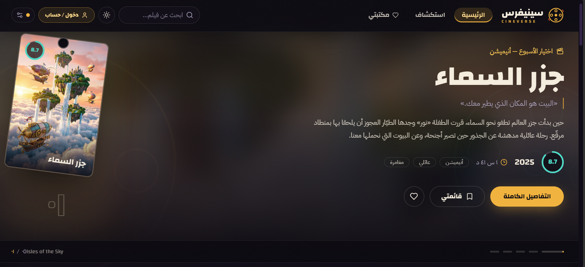
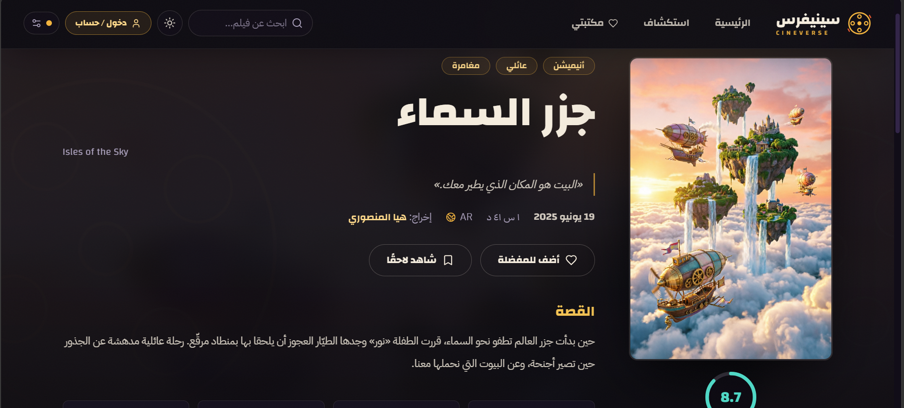
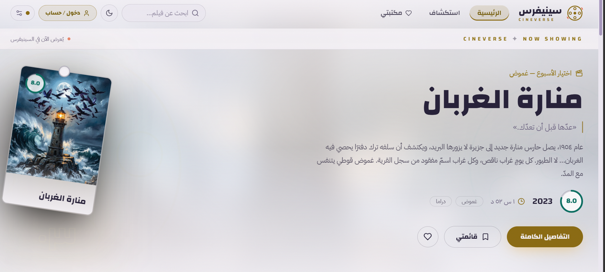

CineVerse - Movie Discovery Application

A modern and comprehensive movie discovery web application built with React and TypeScript.

Features

\- Home page displaying popular, top-rated, and upcoming movies

\- Real-time movie search with advanced filtering

\- Save favorite movies locally using LocalStorage

\- Full Dark/Light mode support

\- Fully responsive design that works seamlessly on all devices

\- Movie details with cast information and similar movies

\- Trailer viewing functionality

Technologies Used

\- Framework: React 18 + TypeScript

\- Styling: Tailwind CSS

\- State Management: Zustand

\- Data Fetching: React Query (TanStack Query)

\- API: TMDB API

\- Build Tool: Vite

\- Routing: React Router v6

Getting Started

Prerequisites

\- Node.js 18 or higher

\- npm or yarn

\\ Installation

1\. Clone the repository:

git clone https://github.com/mayawaeltakla/cineverse.git

cd cineverse

2\. Install dependencies:

npm install

3\. Create a .env file and add your TMDB API key:

VITE\_TMDB\_API\_KEY=your\_api\_key\_here

4\. Run the development server:

npm run dev

5\. Open your browser and visit: http://localhost:5173

Live Demo

Visit the live application: https://cineverse-puce-theta.vercel.app

Screenshots

Home Page

Movie Details

Dark/Light Mode

Project Structure

cineverse/

├── src/

│   ├── components/

│   ├── pages/

│   ├── hooks/

│   ├── services/

│   ├── store/

│   ├── types/

│   ── utils/

├── public/

── README.md

└── package.json

Key Features

API Integration

\- Fetches data from TMDB API

\- Implements pagination for loading more movies

\- Caching with React Query to reduce API calls

Error Handling

\- Loading states with skeleton screens

\- Error states with clear messages

\- Retry mechanism for failed requests

Performance

\- Lazy loading for images

\- Code splitting with React.lazy and Suspense

\- Optimized rendering with React.memo

Accessibility

\- ARIA labels for interactive elements

\- Keyboard navigation support

\- Focus management

\- Semantic HTML structure

Future Enhancements

\- Add user authentication

\- Implement movie reviews and ratings

\- Add watchlist functionality

\- Support for TV shows

\- Multi-language support

Contributing

Contributions are welcome! Please feel free to submit a Pull Request.

License

This project is licensed under the MIT License.

Author

\- GitHub: mayawaeltakla

\- LinkedIn: Maya Waeltakla

\---

Built with React, TypeScript, and Tailwind CSS.

